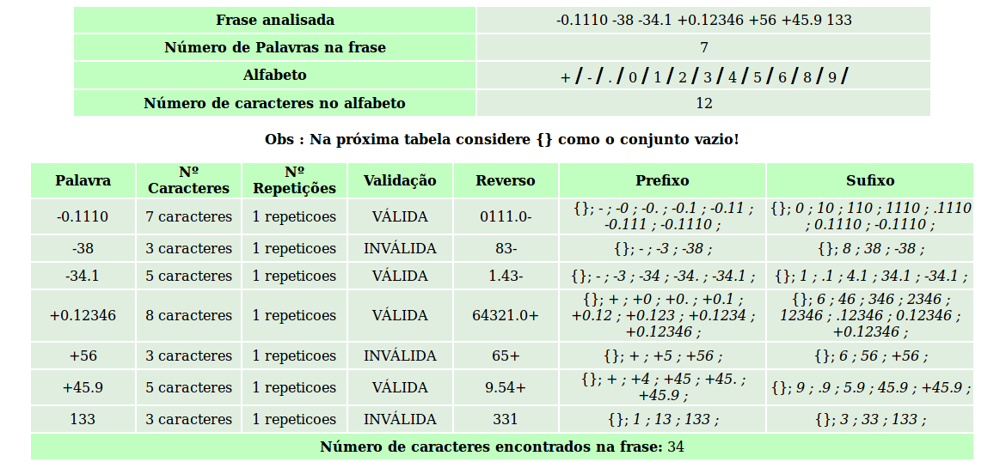

### Validando números decimais
Após ler o arquivo _frase.txt_, o programa retorna:
1. Frese Analisada
2. Número de palavras na frase
3. Alfabeto e o número de caracteres contidos
4. Validação dos números
5. Reverso
6. Sufixo e Prefixo
7. Verifica se existe  uma subpalavra.  

Para utilizar tenha o [PHP](https://secure.php.net/manual/en/install.php) instalado em seu computador.

Abra o terminal e inicie o servidor embutido
    
    $ cd automatos/
    $ php -S  0.0.0.0:8080
    
Caso tenha o [Apache](http://httpd.apache.org/docs/2.4/install.html) instalado inicie com 
    
    $ cd automatos/
    $ php -S localhost:8080

